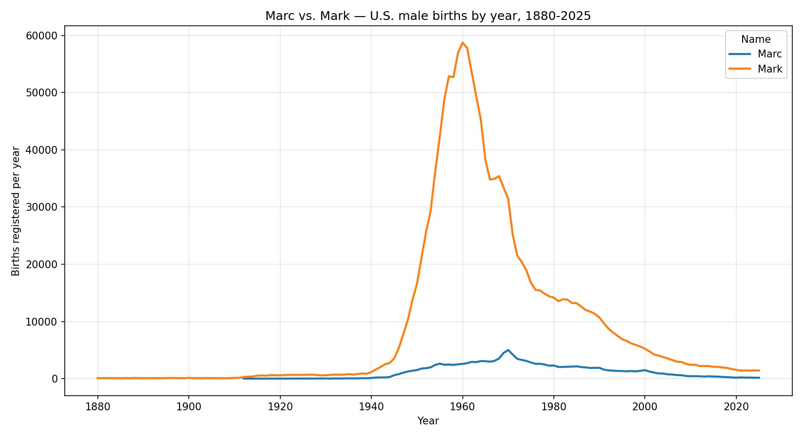

# SQL → Python Analytics Pipeline

An end-to-end analytics project: take a public dataset, shape it with pandas, and answer a specific question with a chart. Built from my coursework in **CIS277A (Data Analytics) at Portland Community College**, then extended so anyone can reproduce it from the original public source.



## Analytical question

How did the popularity of two spellings of the same name - *Marc* and *Mark* - change over time in U.S. male births?

## Key finding

Computed from the official SSA national files, 1880–2025:

| | Peak year | Peak births | First year in data | 2025 |
|---|---|---|---|---|
| **Mark** | **1960** | **58,727** | 1880 | 1,416 |
| **Marc** | **1970** | **5,009** | 1901 | 162 |

Both spellings follow the same broad arc - negligible before the 1940s, a sharp mid-century rise, a peak, then a long decline that continues through 2025. Across their 117 overlapping years the two series track each other closely in rank terms (Spearman **0.97**; Pearson **0.80**).

Two details keep that from being the whole story:

- **The peaks are ten years apart.** Marc's rise and fall lag Mark's by about a decade.
- **The volume gap is not constant.** At their respective peaks Marc reaches roughly **8.5%** of Mark's height, but the year-by-year ratio ranges from under 2% to about 28% (median 12%).

A cautious reading: *the two spellings rose and fell over broadly the same era, with Marc consistently far less common and its trajectory shifted about a decade later.* The data shows the pattern, not its cause.

## Public reproducible pipeline

```
SSA public data files
        ↓
Python / pandas      load 146 yearly files, add year from filename
        ↓
filter + reshape     male births, two names, long → wide pivot
        ↓
analysis             peaks, ratios, correlation, missing-value check
        ↓
matplotlib           time-series comparison
        ↓
insight
```

Notebook: [`notebooks/public-ssa-analysis.ipynb`](notebooks/public-ssa-analysis.ipynb) - committed **executed, with outputs saved**, so you can read the results without running anything.

## Original SQL Server pipeline

The project began as a database exercise, and that version is kept as evidence of a different skill: **getting data out of a SQL Server instance from Python**.

```
SQL Server → pyodbc → pandas → matplotlib
```

Notebook: [`notebooks/sql-to-python-pipeline.ipynb`](notebooks/sql-to-python-pipeline.ipynb)

It demonstrates ODBC driver configuration, a parameterised connection built from environment variables, and SQL issued from Python. **It is preserved as annotated code and is not executed here** - its cells carry no saved outputs, because the course database requires student credentials and is not publicly reachable.

That limitation is exactly why the public path above was added: the analysis now stands on data anyone can download, while the SQL notebook still shows the database work.

## Analysis workflow

1. **Acquire** - fetch the official SSA archive and record provenance (source URL, retrieval time, SHA-256, year range)
2. **Load** - read 146 yearly files, deriving each year from its filename
3. **Filter** - male births, names `Marc` and `Mark`
4. **Reshape** - pivot long → wide, one row per year, one column per name
5. **Verify** - check missing values and understand *why* they are missing
6. **Analyse** - peak year and volume for each name, peak gap, volume ratio, correlation
7. **Visualise** - matplotlib time series
8. **Interpret** - state what the data supports, and what it does not

## Run it yourself

### Public path (no database needed)

```bash
pip install -r requirements.txt
python scripts/download_ssa_data.py
jupyter lab notebooks/public-ssa-analysis.ipynb
```

The script downloads the SSA archive, extracts the yearly files to `data/raw/`, and writes `data/raw/PROVENANCE.json`.

Some networks are blocked by ssa.gov's CDN and get `HTTP 403`. If that happens, download `names.zip` manually from the [landing page](https://www.ssa.gov/oact/babynames/limits.html) and pass it in - validation, extraction, and provenance are identical either way:

```bash
python scripts/download_ssa_data.py --archive path/to/names.zip
```

### Optional: SQL Server path

Runs against any SQL Server instance with a compatible table. Connection settings - including the ODBC driver name, which differs between machines - come from environment variables:

```powershell
$env:DB_SERVER   = "your-server"
$env:DB_NAME     = "your-database"
$env:DB_USER     = "your-user"
$env:DB_PASSWORD = "your-password"
$env:DB_DRIVER   = "ODBC Driver 18 for SQL Server"   # optional; this is the default
jupyter lab notebooks/sql-to-python-pipeline.ipynb
```

## Skills demonstrated

- **SQL** - filtered, ordered queries against SQL Server
- **Python / pandas** - multi-file loading, filtering, `pivot` reshaping, aggregation, correlation
- **matplotlib** - labelled time-series comparison
- **Database connectivity** - pyodbc, Microsoft ODBC Driver, configurable connection strings
- **Public-data ingestion** - scripted download, archive validation, provenance capture
- **Reproducibility** - removing a private-data dependency so the analysis stands on public sources
- **Data-quality reasoning** - recognising that SSA's reporting floor explains the missing early values
- **Environment setup** - Anaconda, JupyterLab, Visual Studio Build Tools on Windows, including diagnosing a JupyterLab launch failure ([docs/process-notes.md](docs/process-notes.md))
- **Security hygiene** - no hard-coded credentials; environment variables only

## Data source

U.S. Social Security Administration - national baby-name totals by year, public domain.

- Archive: [ssa.gov/oact/babynames/names.zip](https://www.ssa.gov/oact/babynames/names.zip)
- Landing page: [ssa.gov/oact/babynames](https://www.ssa.gov/oact/babynames/limits.html)
- Coverage used here: **1880–2025**, 146 yearly files, 2,181,032 rows

Format is one file per year, `Name,Sex,Count`, no header. See [`data/README.md`](data/README.md).

## Limitations

- SSA omits any name with **fewer than 5 occurrences** in a year, so `Marc` has no entry before 1901 - the early gap is a reporting floor, not a true zero.
- Counts come from Social Security card applications, not a complete birth registry.
- This compares two spellings of one name; it is not a general study of naming trends.
- Two series that both rise and fall mid-century will correlate partly because they share an era - correlation here is not evidence that one influenced the other.
- The original SQL notebook cannot be re-run by a reader, since the course database is not public.

## Repository structure

```
├── README.md
├── requirements.txt
├── .gitignore
├── data/
│   ├── README.md                       # source, license, format, how to fetch
│   └── raw/                            # downloaded SSA files (not committed)
├── scripts/
│   └── download_ssa_data.py            # fetch/validate/extract + provenance
├── notebooks/
│   ├── public-ssa-analysis.ipynb       # primary analysis (executed, outputs saved)
│   └── sql-to-python-pipeline.ipynb    # original SQL path (annotated, unexecuted)
├── screenshots/
│   └── names-trend-chart.png           # generated by the public notebook
└── docs/
    └── process-notes.md                # setup story, problems hit, fixes found
```

## Course / portfolio context

Built from CIS277A Data Analytics coursework at Portland Community College and expanded into a public-safe, reproducible portfolio project. It contains only my own work and analysis of public data - no instructor materials, lab instructions, quiz content, or grades.

## Related work

The other two public analytics projects from the same portfolio:

- [What Drives Fuel Economy? A Regression Case Study](https://github.com/KhaylubThompsonCalvin/fuel-economy-analysis) - regression on the public Auto MPG dataset with residual diagnostics, reproducible from a clean clone.
- [Data Science Salary Story](https://public.tableau.com/app/profile/khaylub.thompson/viz/DataScienceSalaryStory/DataScienceSalariesLocationRoleExperienceandTime) - a four point Tableau story on public salary data, published to Tableau Public.

## About me

- Portfolio: [khaylub.com](https://khaylub.com)
- LinkedIn: [khaylub-thompson-calvin](https://www.linkedin.com/in/khaylub-thompson-calvin-40543b294/)
